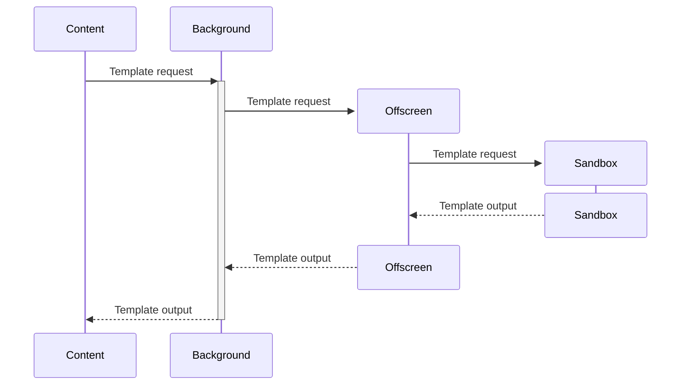

#  Google Scholar annotation exporter

[](https://chromewebstore.google.com/detail/google-scholar-annotation/dkcipnihgbegpammhgkobheodoknplma)
[](./LICENSE)
[](https://developer.chrome.com/docs/extensions/mv3/intro/)

Export your [Google Scholar PDF Reader](https://chromewebstore.google.com/detail/google-scholar-pdf-reader/dahenjhkoodjbpjheillcadbppiidmhp) annotations (highlights and notes) to JSON, CSV, LaTeX, Markdown or custom format.

## Installation

1. Install the [Google Scholar PDF Reader](https://chromewebstore.google.com/detail/google-scholar-pdf-reader/dahenjhkoodjbpjheillcadbppiidmhp) extension.
2. Install the [Google Scholar annotation exporter](https://chromewebstore.google.com/detail/google-scholar-annotation/dkcipnihgbegpammhgkobheodoknplma) extension.
3. Open a PDF in Google Scholar PDF Reader, click the "Export annotations" button in the toolbar, and choose your preferred export format.

## Permissions

This extension requests two permissions:

- `Host permissions` for `scholar.google.com` and `scholar.google.com.tw`: the extension only runs on Google Scholar pages because it needs to read the paper list, citations, highlights, and notes from the Scholar PDF reader interface.
  Without access to those pages, it cannot collect the annotation data that users explicitly choose to export.
- `Storage`: the extension stores user preferences such as export format and citation style, and it also keeps temporary export state while processing multiple pages.
  This allows the multi-page export flow to continue correctly across navigations and lets the extension remember the user’s settings between sessions and browser (as long as the user has enabled synchronization).
- `Offscreen`: the extension uses an offscreen document to process custom templates in a sandboxed environment, which is required by Chrome’s security policies for extensions. See the [Custom templates](#custom-templates) section for more information.

## Output format

The exported annotations will be saved in the chosen format with the following structure:

### JSON

```json
{
  "extension": "Google Scholar annotation exporter",
  "extensionHomepage": "https://chromewebstore.google.com/detail/google-scholar-annotation/dkcipnihgbegpammhgkobheodoknplma",
  "extensionVersion": "1.0.0",
  "exportDate": "2023-01-01T12:00:00Z",
  "numberOfPapers": 1,
  "numberOfAnnotations": 2,
  "version": "1.0",
  "papers": [
    {
      "error": "",
      "captcha": false,
      "citation": "Author 1, Author 2, 2023. Paper Title. Journal Name.",
      "metadata": ["Author 1, Author 2", "Journal Name, 2023"],
      "title": "Paper Title",
      "authors": "Author 1, Author 2",
      "journal": "Journal Name",
      "year": "2023",
      "link": "https://link.to.paper.pdf",
      "annotations": [
        {
          "highlightText": "indeed.",
          "note": "This is a note for the highlighted text.",
          "highlightColor": "Purple",
          "page": 1,
          "context": "This is the context of the highlighted text indeed."
        },
        {
          "highlightText": "Another highlighted text.",
          "note": "",
          "highlightColor": "Yellow",
          "page": 2,
          "context": ""
        }
      ]
    }
  ]
}
```

### CSV

```csv
Title,Authors,Journal,Year,Link,Citation,Annotations
Paper Title,"Author 1, Author 2",Journal Name,2023,https://link.to.paper.pdf,"Author 1, Author 2. Paper Title. Journal Name, 2023.","indeed~~~This is a note for the highlighted text.~~~This is the context of the highlighted text indeed.~~~Purple~~~1|||Another highlighted text.~~~~~~~~~Yellow~~~2"
```

### LaTeX

```latex
\documentclass{article}
\usepackage[utf8]{inputenc}
\usepackage{hyperref}

\title{ Google Scholar annotation exporter }
\date{ 2023-01-01T12:00:00Z }
\author{ Google Scholar annotation exporter }

\begin{document}

\maketitle
\tableofcontents
\section{ Paper Title }

\begin{center}
  \begin{tabular}{||l l||}
    \hline
    \textbf{Field}   & \textbf{Value}                          \\ [0.5ex]
    \hline\hline
    \textbf{Authors} & Author 1, Author 2                      \\
    \hline
    \textbf{Journal} & Journal Name                            \\
    \hline
    \textbf{Year}    & 2023                                    \\
    \hline
    \textbf{Link}    & \href{ https://link.to.paper.pdf }{PDF} \\
    \hline
  \end{tabular}
\end{center}
\subsection{Citation}

Author 1, Author 2, 2023. Paper Title. Journal Name

\subsection{Annotations}

\subsubsection{ indeed. }
\begin{itemize}
  \item \textbf{Note}: This is a note for the highlighted text.
  \item \textbf{Color}: Purple
  \item \textbf{Page}: 1
\end{itemize}
\subsubsection{ Another highlighted text. }
\begin{itemize}
  \item \textbf{Color}: Yellow
  \item \textbf{Page}: 2
\end{itemize}

\end{document}
```

### Markdown

```markdown
---
extension: Google Scholar annotation exporter
extension_homepage: https://chromewebstore.google.com/detail/google-scholar-annotation/dkcipnihgbegpammhgkobheodoknplma
extension_version: 1.0
export_date: 2023-01-01T12:00:00Z
number_of_papers: 1
number_of_annotations: 2
---

# Google Scholar Annotations Export

## Paper Title

| Metadata    | Value                            |
| ----------- | -------------------------------- |
| **Authors** | Author 1, Author 2               |
| **Journal** | Journal Name                     |
| **Year**    | 2023                             |
| **Link**    | [PDF](https://link.to.paper.pdf) |

### Annotations

1. | Field         | Value                                               |
   | ------------- | --------------------------------------------------- |
   | **Highlight** | indeed.                                             |
   | **Note**      | This is a note for the highlighted text.            |
   | **Context**   | This is the context of the highlighted text indeed. |
   | **Color**     | Purple                                              |
   | **Page**      | 1                                                   |
2. | Field         | Value                     |
   | ------------- | ------------------------- |
   | **Highlight** | Another highlighted text. |
   | **Note**      |                           |
   | **Context**   |                           |
   | **Color**     | Yellow                    |
   | **Page**      | 2                         |

---
```

### Custom format

You can customize the output by providing your own [Handlebars](https://handlebarsjs.com/) template in the "Advanced options" modal.
The default templates are located in the [`src/templates`](./src/templates) folder, and you can use them as a starting point for your own custom templates.
For more information on how to use Handlebars templates, please refer to the [Handlebars documentation](https://handlebarsjs.com/guide/).

The context exposed to the templates includes the following properties:

```typescript
type Context = {
  extension: string;
  extensionHomepage: string;
  extensionVersion: string;
  exportDate: string;
  numberOfPapers: number;
  numberOfAnnotations: number;
  papers: Paper[];
};

type Paper = {
  error: string;
  captcha: boolean;
  title: string;
  authors: string;
  year: string;
  link: string;
  citation: string;
  metadata: string[];
  annotations: Annotation[];
  journal: string;
};

export type Annotation = {
  highlightText: string;
  note: string;
  highlightColor: string;
  context: string;
  page: number;
};
```

## Development

To contribute to this project, please follow these steps:

1. Clone the repository (`git clone https://github.com/TendTo/google-scholar-annotation-exporter.git`).
2. Install dependencies: `npm install` (or `yarn install` or `pnpm install`).
3. Build the project: `npm run build` (or `yarn build` or `pnpm build`).
4. Load the extension in Chrome:
   - Open `chrome://extensions/` in Chrome.
   - Enable "Developer mode" (toggle switch in the top right corner).
   - Click "Load unpacked" and select the project root folder (the one containing the `manifest.json` file).
5. Make changes to the source code in the `src` folder, and rebuild the project as needed.
   Alternatively, you can use `npm run watch` (or `yarn watch` or `pnpm watch`) to automatically rebuild the project when changes are made.
   You may need to reload the extension in Chrome after rebuilding.

### Custom templates

The output produced by this extension is generated using [Handlebars](https://handlebarsjs.com/) templates.
The templates are located in the [`src/templates`](./src/templates) folder, and they are compiled into JavaScript files during the build process.
This is due to the fact that Chrome extensions are [restricted](https://developer.chrome.com/docs/extensions/how-to/security/sandboxing-eval) from using `eval()` and similar functionalities, which are vital for Handlebars to compile templates at runtime.
The precompiled JavaScript files that can be used directly by the extension without incurring in any security issue.  
There is a cumbersome way to circumvent the limitation: it requires to relay the request from the content script, to the background script, to an offscreen script, and finally to a sandboxed iframe.



## Alternatives

- [Google Scholar Highlights Export](https://chromewebstore.google.com/detail/google-scholar-highlights/dkolmloddjhhdeobedcgcgohoeoeekpj)
